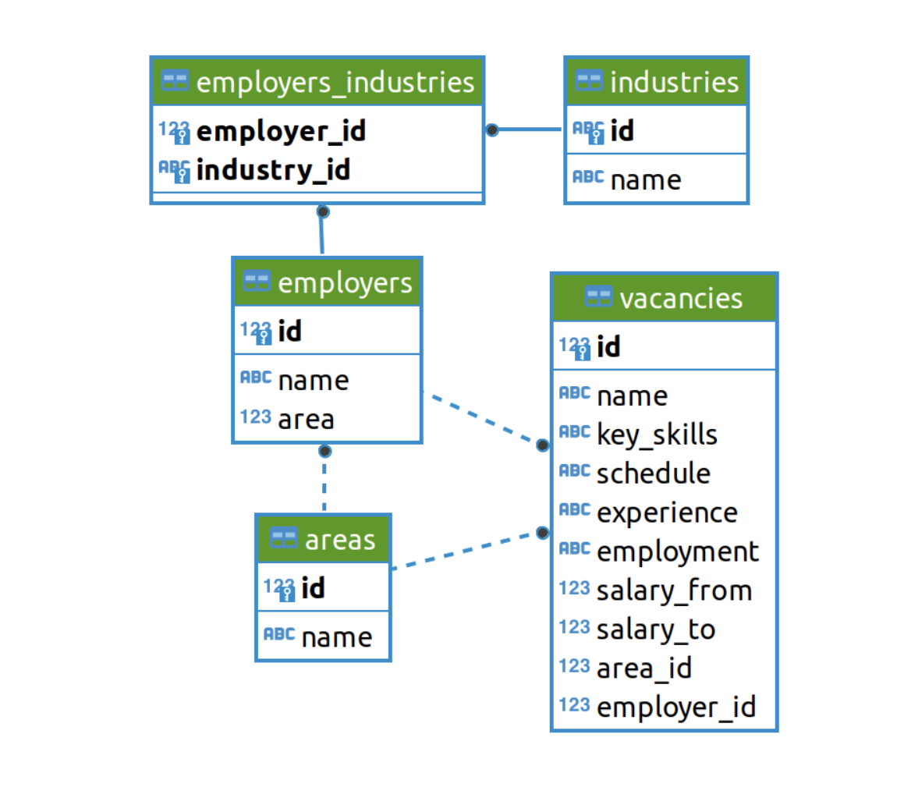

# Проект 2. Анализ вакансий из HeadHunter

## Оглавление  
[1. Описание проекта](README.md#Описание-проекта)  
[2. Какой кейс решаем?](README.md#Какой-кейс-решаем)  
[3. Краткая информация о данных](README.md#Краткая-информация-о-данных)  
[4. Этапы работы над проектом](README.md#Этапы-работы-над-проектом)  
[5. Результат](README.md#Результат)    
[6. Выводы](README.md#Выводы) 

### Описание проекта    
По имеющейся структуре БД с помощью SQL запросов проанализируем вакансии, работодателей и требования к специалистам Data science

:arrow_up:[к оглавлению](_)

**Что практикуем**     
Анализ данных с помощью SQL запросов, запросов внешного API (soap или json) для дальнейшего использования

:arrow_up:[к оглавлению](_)

### Краткая информация о данных
Данные хранятся в БД Postgres. Структура данных представлена на рисунке ниже

:arrow_up:[к оглавлению](README.md#Оглавление)

### Этапы работы над проектом  
1. Знакомство с данными;
2. Предварительный анализ данных;
3. Детальный анализ вакансий;
4. Анализ работодателей;
5. Предметный анализ вакансий Data science.

:arrow_up:[к оглавлению](README.md#Оглавление)

### Результаты:  
Представлены в [ноутбуке](hh.ipynb)

:arrow_up:[к оглавлению](README.md#Оглавление)

### Выводы:  

:arrow_up:[к оглавлению](README.md#Оглавление)

Если информация по этому проекту покажется вам интересной или полезной, то я буду очень вам благодарен, если отметите репозиторий и профиль ⭐️⭐️⭐️-дами